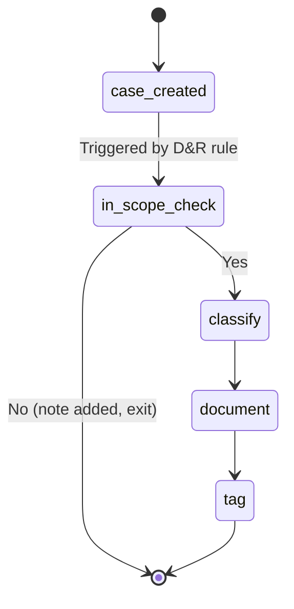

# Case-Reviewer Agent

The case-reviewer agent is the continuous, event-driven half of `lc-compliance`. After you deploy it into a LimaCharlie organization, it watches the [Cases](../../5-integrations/extensions/limacharlie/cases.md) queue. It classifies each new case against the specific control citations of the framework, and it writes audit-grade documentation into the case record. The agent is built on [D&R-Driven AI Sessions](../dr-sessions.md).

There is one reviewer agent for each framework. You can deploy more than one reviewer into the same organization. For example, an organization that is in scope for PCI DSS and for SOC 2 can run `pci-compliance-reviewer` and `soc2-compliance-reviewer` together, each scoped to its own tag.

## How it works


```mermaid
stateDiagram-v2
    [*] --> case_created
    case_created --> in_scope_check: Triggered by D&R rule
    in_scope_check --> classify: Yes
    in_scope_check --> [*]: No (note added, exit)
    classify --> document
    document --> tag
    tag --> [*]
```

1. A detection fires on an in-scope sensor (for example, a `cde`-tagged endpoint for PCI).
2. The Cases extension creates a case from the detection.
3. A webhook adapter sends a `case_created` event.
4. A D&R rule that `compliance-deploy` installed matches the event and calls the agent with the `start ai agent` response action.
5. The agent does the **suppression** check (maximum 10 cases each minute globally) and the **debounce** check (one review for each case at a time) before it starts work.
6. The agent does a **scope check** to find if the case is in scope for the framework. The check looks at the tags of the sensor and at the detection category.
    - If the case is not in scope, the agent adds a "not in scope" note to the case and exits.
    - If the case is in scope, the agent continues.
7. The agent **maps the event** to one or more specific control citations from the framework.
8. The agent **classifies the compliance impact**:
    - **Control functioning** — the detection is evidence that a control operates correctly
    - **Control gap** — the event shows a control that is missing or weak
    - **In-scope operational** — a routine in-scope event that does not show a security incident
    - **Security incident with compliance impact** — a real incident that the QSA or ISSO must know about
9. The agent **writes** a QSA-ready summary, a conclusion, and analysis notes into the case with the case-investigation API. It then tags the case with the compliance classification.

The agent is **read-only against your deployed configuration**. It reads detections, events, sensor metadata, hive records, and case data. It writes only to the case that triggered it: notes, conclusion, and tags. It does not change D&R rules, exfil entries, FIM entries, sensors, secrets, or any other configuration of the organization.

## Deployment

Deploy the reviewer for a framework with the [`compliance-deploy`](skills.md#compliance-deploy) skill:

```text
/lc-compliance:compliance-deploy pci-dss --oid <your-oid>
```

The skill takes you through the creation of the API key, the staging of the Anthropic secret, the sync of the agent hive record, and the installation of the trigger D&R rule. It asks for confirmation at each write to the cloud. The deployment uses three [Config Hive](../../7-administration/config-hive/index.md) areas:

| Hive | Record name | Purpose |
|---|---|---|
| `ai_agent` | `<framework>-compliance-reviewer` | Agent prompt, model, tool allowlist, budget |
| `dr-general` | `<framework>-compliance-reviewer-trigger` | The D&R rule that starts the agent on `case_created` |
| `secret` | `<framework>-compliance-reviewer` and `anthropic-key` | Scoped LC API key and Anthropic API key |

After the deployment, the agent identifier is `<framework>-compliance-reviewer`, for example `pci-compliance-reviewer` or `hipaa-compliance-reviewer`. You can call the same identifier manually from the CLI for ad-hoc reviews. See [Manual invocation](#manual-invocation).

## Permissions

The scoped LimaCharlie API key that `compliance-deploy` creates gets only the permissions that the reviewer needs to operate:

| Permission | Reason |
|---|---|
| `org.get` | Read organization metadata |
| `sensor.list`, `sensor.get` | Identify in-scope sensors with tag selectors |
| `dr.list` | Read the names and metadata of deployed D&R rules for compliance correlation |
| `insight.det.get` | Read the detections that are linked to the case |
| `insight.evt.get` | Read historical events for context |
| `investigation.get`, `investigation.set` | Read and update the case |
| `ext.request`, `ext.list` | Communicate with the Cases extension and list subscribed extensions |
| `org_notes.read` | Read notes at the organization level for context |
| `sop.get`, `sop.get.mtd` | Read the Standard Operating Procedures that apply to the case |
| `ai_agent.operate` | Operate as an AI agent in the organization |

The agent does **not** get write access to D&R rules, FIM rules, exfil configuration, sensor configuration, or installation keys. The API key enforces the least-privilege scope. If the prompt of the agent asked it to change configuration, the API would reject the call.

## Scope: what the agent reviews

The reviewer scopes itself by **sensor tag**, **detection category**, **detection rule tags**, and **rule metadata**. A case is in scope when *any* of these signals matches the framework. Each reviewer accepts these canonical scope tags:

| Framework | Accepted scope tags |
|---|---|
| pci-dss | `cde`, `pci-scope`, `card-data`, `pci-dss` |
| hipaa | `ephi-host`, `hipaa-scope`, `phi-host`, `covered-entity` |
| cmmc | `cui`, `cui-host`, `cmmc-scope`, `dib-host` |
| nist-800-53 | `fisma-scope`, `fedramp-scope`, `federal-system`, `nist-scope` |
| soc2 | `soc2-scope`, `in-scope-system`, `audit-scope` |
| iso-27001 | `isms-scope`, `iso-scope`, `iso-27001-scope`, `soa-included` |
| cis-v8 | `cis-scope`, `cis-v8-scope` (plus optional `cis-ig1`/`cis-ig2`/`cis-ig3` for tier) |

The full scope check of the reviewer looks at these signals, in order:

1. **Sensor tag match.** The case is in scope if the sensor of origin has any tag from the accepted list of the framework.
2. **Detection category match.** The case is in scope if the detection category starts with the prefix of the framework (`pci-`, `hipaa-`, `cmmc-`, `nist-`, `soc2-`, `iso-`, `cis-`).
3. **Rule-tag match.** The case is in scope if the rule tags of any linked detection include the framework identifier (for example, `pci-dss`).
4. **Rule metadata match.** The case is in scope if the rule metadata of any linked detection has the citation key of the framework (for example, `pci_dss_req:`, `hipaa_safeguard:`, `cis_safeguard:`).

If a case matches none of these signals, the reviewer adds one note that explains why ("not in <framework> scope. No compliance review performed.") and exits. It does not change the classification, severity, status, or tags.

The prompt of the agent holds the scoping logic. The prompt is one of the fields of the `ai_agent` hive record. Operators can change the scoping behavior when they edit the hive record. See [Customization](#customization).

## Evidence model

The reviewer writes four artifacts into each in-scope case:

1. **Summary** (`--summary`) — one paragraph that states the host, the event, the control citations, and the compliance classification.
2. **Conclusion** (`--conclusion`) — some sentences that map the event to specific control numbers and classify it (see [Classifications](#classifications) below). The conclusion cites evidence: sensor ID, hostname, event timestamp, and detection rule name. It also states the recommended remediation if there is one.
3. **Analysis note** (`case add-note --type analysis`) — a detailed technical timeline in markdown. It includes verbatim event data, correlated events, and a clear statement of the scope decision.
4. **Classification tags** — added with `case tag add`. Each reviewer uses tags with the framework prefix, so reviewers for different frameworks can run together without a collision.

### Classifications

Every in-scope case gets one of four classification tags. The tag names use the framework-prefix convention:

| Classification | PCI tag | HIPAA tag | Pattern |
|---|---|---|---|
| Control functioning as designed | `pci-control-functioning` | `hipaa-control-functioning` | `<framework>-control-functioning` |
| Control gap revealed | `pci-control-gap` | `hipaa-control-gap` | `<framework>-control-gap` |
| In-scope operational activity | `pci-in-scope-ops` | `hipaa-in-scope-ops` | `<framework>-in-scope-ops` |
| Security incident with framework impact | `pci-security-incident` | `hipaa-security-incident` | `<framework>-security-incident` |

During the review, the case also carries a temporary `<framework>-reviewing` tag, for example `pci-reviewing`. The reviewer adds this tag at the start of its workflow and removes it at the end. This tag shows that a review is in progress. It is not the final classification.

Auditors that sample evidence work from the case queue and filter by classification tag and framework. The agent does not make stand-alone reports or PDFs. The case record is the evidence.

For a quarterly or annual roll-up across cases, query the case queue with the [Cases API](https://cases.limacharlie.io/openapi) and aggregate the classifications outside LimaCharlie.

## Manual invocation

You can also call a deployed reviewer ad-hoc against an existing case from the CLI:

```bash
limacharlie ai start-session \
    --definition <framework>-compliance-reviewer \
    --prompt "Review case <case-number> against <framework> controls."
```

Use this command to review cases again after you update the prompt of the agent, or to review cases that are older than the deployment of the agent. The [AI Sessions CLI reference](../cli.md) gives the full command set.

## Customization

The `ai_agent` hive record `<framework>-compliance-reviewer` defines the behavior of the agent. Operators can change:

- **The system prompt** — to match the compliance practices, scope rules, and escalation paths of the organization
- **The tool allowlist** — to restrict or expand the capabilities of the agent
- **The model and budget** — to change the AI model or to cap the cost of each session
- **The trigger rule** — edit the `dr-general` record `<framework>-compliance-reviewer-trigger` to change which `case_created` events start the agent (for example, to review only cases with high severity)

To inspect or edit the records:

```bash
limacharlie hive get --hive-name ai_agent --key <framework>-compliance-reviewer --oid <your-oid>
limacharlie hive get --hive-name dr-general --key <framework>-compliance-reviewer-trigger --oid <your-oid>
```

To get the customizations again from a new version of the plugin, run `compliance-deploy` again. This overwrites your local edits. The skill gives a warning before it overwrites an existing record.

## Cost and budget

Each run of the agent uses Anthropic API tokens. Anthropic bills these tokens to your account through the staged key. LimaCharlie adds a small AI Sessions runtime charge. The hive record of the agent holds the default budget. The [AI Sessions billing section](../index.md#billing) gives the current rates. Use the `max_budget_usd` parameter to cap the cost of each session.

The suppression and debounce settings stop repeated calls when a noisy rule triggers many cases at the same time. These settings are the global cap of 10 cases each minute and the lock of one review for each case. You can configure both in the trigger D&R rule.

## Limitations

- **The agent does not issue compliance attestations.** It produces evidence. The human auditor, QSA, or ISSO decides the compliance status.
- **The agent does not take response actions.** It documents and classifies. It does not contain endpoints, stop processes, or change configuration.
- **The agent depends on accurate scope tags.** The PCI reviewer does not treat a sensor as in scope if the sensor handles cardholder data but has no `cde` tag. Tag accuracy is an operational responsibility. Audit your tags at regular times with `compliance-gap`, which shows problems in sensor coverage.
- **The agent is best-effort, not deterministic.** It is an AI agent, and its output changes a little between runs. For important cases, treat the output of the agent as first-draft documentation. A human analyst must review it before the auditor sees it.

## See also

- [D&R-Driven Sessions](../dr-sessions.md) — the execution model below the agent
- [Cases](../../5-integrations/extensions/limacharlie/cases.md) — the case lifecycle that the agent works on
- [Hive Secrets](../../7-administration/config-hive/secrets.md) — where the API keys of the agent are stored
- [Alternative AI Providers](../alternative-providers.md) — how to route through Bedrock or Vertex AI instead of Anthropic direct
- [Skills Reference](skills.md) — `compliance-deploy` syntax and behavior
