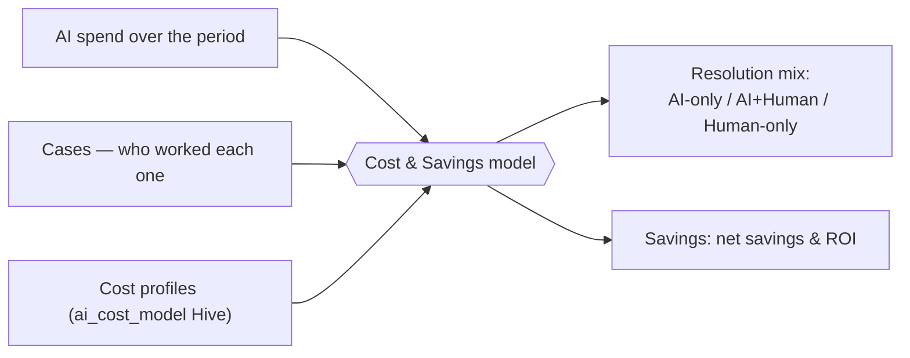
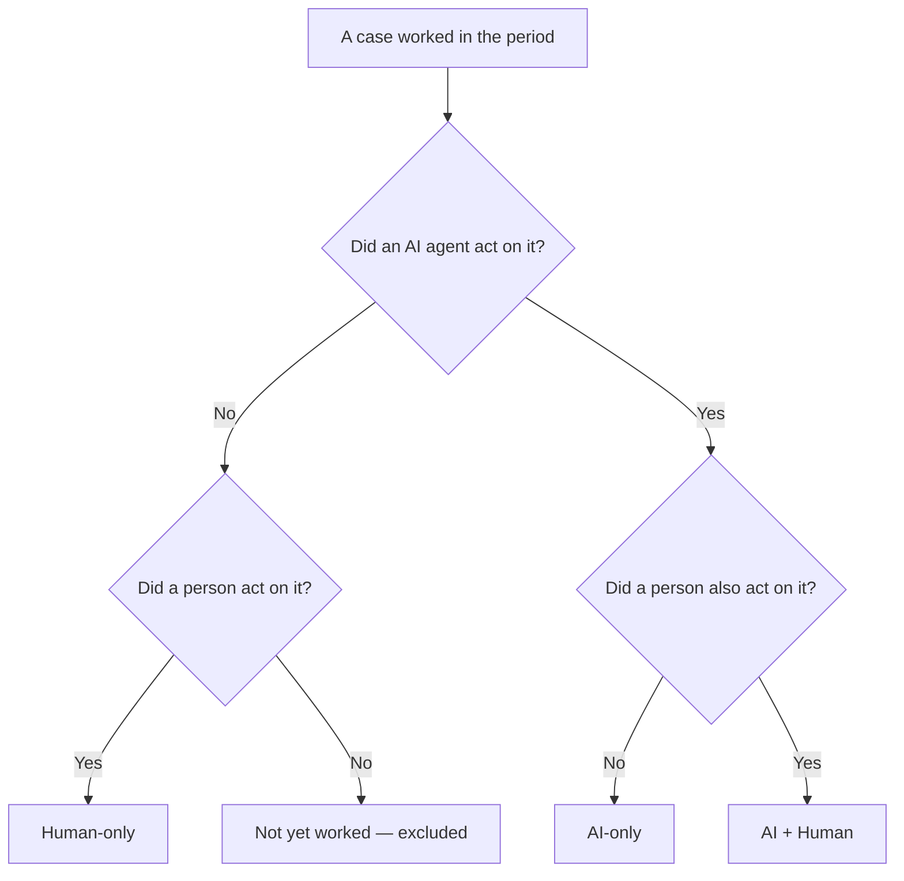
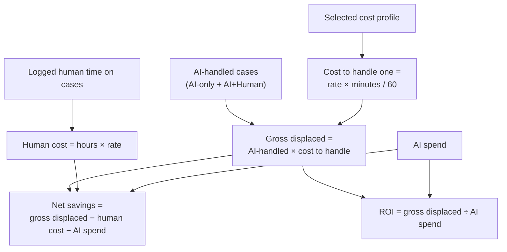

# AI Cost & Savings

LimaCharlie tracks two things about your AI agents: **what they cost**, and **how much analyst work they take off your team's plate**. The second is expressed in dollars you can put in front of a CFO and defend, line by line.

This page explains exactly how those numbers are produced — every input, the formula, and the assumptions — so that the figure you see is something you understand and can tune, not a black box.

## The big picture

The model combines three things you already have in LimaCharlie:

- **Your AI spend** — what your AI agents cost to run over a period.
- **Your Cases** — the investigations that were worked, and *who* worked each one.
- **Your cost profiles** — what an hour of analyst time is worth to you, and how long an investigation takes by hand.

From those, it produces a **resolution mix** (how investigations were handled) and a **savings figure** (the analyst work AI displaced, minus what it cost).

## The core idea: who did the work

The model does **not** try to guess whether a piece of work was "worth doing." It starts from a simpler, more honest premise:

> Every case is real work that had to be done. The only question is **who did it** — an AI agent, a human analyst, or both.

So every case that was worked in the period falls into one of three buckets:

| Resolution | Meaning |
|---|---|
| **AI-only** | An AI agent worked the case and no person took action on it. |
| **AI + Human** | Both an AI agent and a person took action on the case. |
| **Human-only** | Only people worked the case — AI was not involved. This is the baseline you're trying to shrink. |

How does LimaCharlie know? From the **case timeline**. Every action on a case is recorded there — when an AI agent adds its findings, classifies, or resolves a case, that activity is attributed to the agent; when an analyst does the same, it's attributed to the person. A case is "AI-touched" if an agent acted on it, and "human-touched" if a person acted on it.

The **resolution mix** — the share of investigations in each bucket — is the headline metric. It tells you, at a glance, how much of your investigative workload your agents are actually carrying.

## Cost profiles

A **cost profile** is a named category of analyst work that AI stands in for — for example *SOC L1 triage* or *Incident responder*. Each profile answers two questions:

- What does an hour of this analyst's time cost you (fully burdened)?
- How long does one investigation of this kind take to handle **by hand**, without AI?

Profiles are stored as records in the **`ai_cost_model` Hive**, one record per profile. Because Hives are per-organization, each organization (and, for an MSSP, each managed tenant) has its own set of profiles.

Each profile has these fields:

| Field | Meaning |
|---|---|
| `label` | Display name, e.g. "SOC L1 Triage". |
| `loaded_hourly_rate` | Fully-burdened analyst cost per hour, in USD (salary + benefits + overhead). |
| `minutes_per_investigation` | Standard analyst minutes to handle one investigation of this work **without** AI. |
| `rate_source_note` | Free-text note recording where the rate came from — shown alongside the savings figure so it's defensible in a finance review. |

You can manage profiles two ways:

- In the **AI Agents usage view** in the web app, open **Profiles** to add, edit, or remove them.
- Directly as records in the **`ai_cost_model` Hive** (Infrastructure-as-Code, the API, or the [CLI](cli.md)).

A typical set of profiles for a managed SOC might look like:

| Profile | Loaded rate | Minutes / investigation | Cost to handle one |
|---|---|---|---|
| SOC L1 Triage | $55/hr | 12 | $11.00 |
| SOC L2 Analyst | $85/hr | 45 | $63.75 |
| Incident Responder | $120/hr | 180 | $360.00 |

"Cost to handle one" is simply `loaded_hourly_rate × minutes_per_investigation / 60` — the standard cost of one investigation of that kind. It's the only modeled number in the whole system; everything else is measured.

## How savings are calculated

Savings answer: *of the work the AI agents did, how much analyst labor did that displace, and what did it cost?* The calculation runs against the cost profile you select.

Step by step:

1. **Count the AI-handled cases.** That's the AI-only and AI+Human buckets combined — every case an agent touched.
2. **Value each one at the cost to handle it.** Multiply the AI-handled count by the selected profile's cost-to-handle. This is the **gross displaced labor**: what it would have cost to do all that work by hand.
    - Note the crediting rule: **any case an AI agent worked is credited the full cost to handle it** — including AI+Human cases. We then subtract the human time that was actually spent (next step), rather than trying to estimate a split.
3. **Subtract the human time that was still spent.** When an analyst logs time against a case (see below), that time is valued at the profile rate and subtracted. If no human time was logged, nothing is subtracted.
4. **Subtract the AI spend.** What the agents cost to run over the period.
5. **The result is net savings.** And **ROI** is the gross displaced labor divided by the AI spend.

### A worked example

Over the last 30 days, using the *SOC L1 Triage* profile ($55/hr, 12 min → $11.00 to handle one):

| Quantity | Value |
|---|---|
| AI-only cases | 800 |
| AI+Human cases | 150 |
| Human-only cases | 200 |
| Logged human time (on the AI+Human cases) | 40 hours |
| AI spend | $260 |

- AI-handled cases = 800 + 150 = **950**
- Gross displaced labor = 950 × $11.00 = **$10,450**
- Human cost = 40 hrs × $55 = **$2,200**
- Net savings = $10,450 − $2,200 − $260 = **$7,990**
- ROI = $10,450 ÷ $260 ≈ **40×**
- Resolution mix = 70% AI-only, 13% AI+Human, 17% Human-only

Every number traces back to something concrete: the case counts come from your Cases, the human cost from logged time, the AI spend from your agents' usage, and the rate from a profile you set with a documented source.

## Logging human time on cases

For AI+Human cases, the human still spent some time — and the only honest way to know how much is for the analyst to **record it on the case**. When time is logged on a case, it's subtracted from the gross displaced labor, so the savings figure reflects the work AI genuinely took off your team.

If your team doesn't log time, the model still works — AI+Human cases are credited the full cost to handle them (the crediting rule above), and you simply won't see the human time netted out. Logging time makes the figure more precise; it's never required.

## AI spend

The **AI spend** in the calculation is what your AI agents cost to run over the selected period — the token cost of their sessions. You can see this same usage in the **AI Agents usage view**, broken down by agent and model. In the savings calculation it's attributed across the organization for the period.

## Reading the panel

In the AI Agents usage view you'll see, for the selected time range:

- The **resolution mix** as a single bar — the share of investigations that were AI-only, AI+Human, and Human-only — with the counts beside it.
- The **net savings** and **ROI**, with the full arithmetic shown beneath (gross displaced − human time − AI spend = net savings).
- A **profile selector** if you've defined more than one cost profile, so you can value the same activity against different kinds of analyst work.
- The **rate source note** from the selected profile, so anyone reading the figure can see where the rate came from.

If you haven't created a profile yet, the panel prompts you to add one. If there's no AI activity in the range, it says so rather than showing an empty number.

## Tuning it for trust

A few practices make the figure something you can stand behind:

- **Use your real loaded rate**, and fill in the `rate_source_note` (e.g. "FY26 loaded SOC cost ÷ 1,600 productive hours"). The number is only as credible as its rate.
- **Set realistic handling times.** `minutes_per_investigation` should reflect what a comparable investigation actually takes your team by hand.
- **Log human time** on cases your analysts touch, so AI+Human savings reflect reality.
- **Define a profile per kind of work** (triage vs. deep IR) and select the one that matches what you're measuring.

A note on precision: the **resolution mix is measured** from your Cases — it is not an estimate. The **savings figure depends on the cost profile you provide**, so it's only as accurate as that profile. All amounts are in **USD**.

## FAQ

**What counts as an AI agent "working" a case?**
Any action an AI agent records on the case — adding findings or notes, classifying it, or resolving it. That activity appears on the case timeline and is attributed to the agent.

**Why is a case counted as AI+Human?**
Because both an agent and a person took action on it. The AI did work on the case, and an analyst also did. It's credited the full cost-to-handle, with any logged human time subtracted.

**Are Human-only cases counted as savings?**
No. They're shown in the resolution mix as your manual baseline, but they contribute nothing to savings — AI wasn't involved.

**My SOC has several analyst tiers with different rates. How do I model that?**
Create a cost profile for each (e.g. L1, L2, IR), each with its own rate and handling time, and select the profile that matches the work you're valuing.

**Is this a bill or a charge?**
No. The savings figure is an internal estimate of displaced analyst labor for your own reporting. It is not an invoice and nothing is charged based on it.

**Why might savings be negative?**
If AI spend (plus any logged human time) exceeds the value of the work displaced, the figure is shown as a net cost — honestly — rather than hidden. That's a sign to revisit the profile, or that the agents are doing low-volume or expensive work.

## See also

- [D&R-Driven Sessions](dr-sessions.md) — how agents are triggered to work cases automatically.
- [Tool Permissions & Profiles](tool-permissions.md) — what agents are allowed to do.
- [Command Line Interface](cli.md) — manage Hive records, including `ai_cost_model`, from the CLI.
