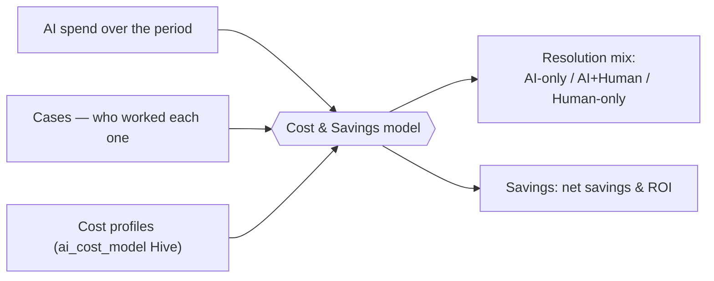
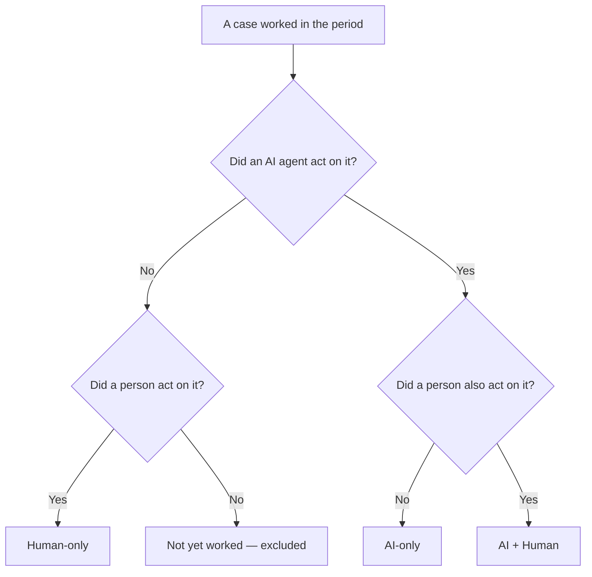
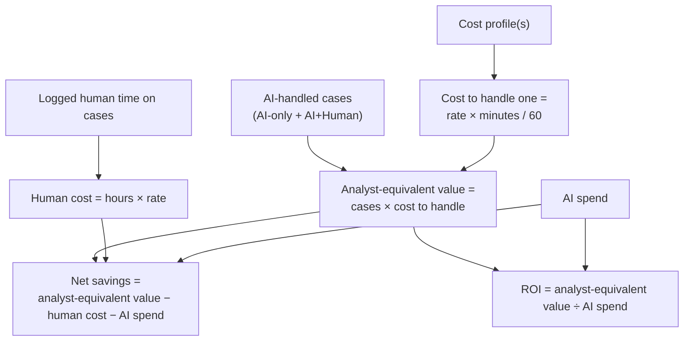

# AI Cost Tracking & Savings

LimaCharlie tracks two things about your AI agents: **what they cost**, and **how much analyst work they remove from your team**. LimaCharlie gives the second in dollars that you can show to a CFO and defend, line by line. It measures the figure from your real mix of case resolutions, not from a hypothetical mix.

This page explains how LimaCharlie produces those numbers: every input, the formula, and the assumptions. You can then understand and tune the figure that you see. For the hard cap on spend for one session, see `max_budget_usd` in [D&R-Driven Sessions](dr-sessions.md) and [User Sessions](user-sessions.md).

## Where to find it

| View | Location | Scope |
|------|----------|-------|
| **Cost Analytics** | An organization's AI Agents usage page | AI spend, tokens, and unit economics for one organization, broken down by model and by trigger rule |
| **AI Resolution & Savings** | Same AI Agents usage page | The savings model: resolution mix, analyst-equivalent value, ROI, per-profile P&L |
| **AI Savings (7d)** | Fleet Billing → AI Spend tab | A cross-tenant (MSSP) rollup of savings across every managed organization |

## The big picture

The model combines three things that you already have in LimaCharlie:

- **Your AI spend** — what your AI agents cost to run over a period.
- **Your Cases** — the investigations that were worked, and *who* worked each one.
- **Your cost profiles** — what an hour of analyst time is worth to you, and how long an investigation takes by hand.

From these, the model produces a **resolution mix** (how the investigations were handled) and a **savings figure** (the analyst work that AI displaced, minus what the AI cost).



## The core idea: who did the work

The model does **not** try to guess if a piece of work was "worth doing". It starts from a simpler premise:

> Every case is real work that had to be done. The only question is **who did it** — an AI agent, a human analyst, or both.

Every case that was worked in the period is in one of three buckets:

| Resolution | Meaning |
|---|---|
| **AI-only** | An AI agent worked the case and no person took action on it. |
| **AI + Human** | Both an AI agent and a person took action on the case. |
| **Human-only** | Only people worked the case. AI was not involved. This is the baseline that you try to make smaller. |

LimaCharlie gets this from the **case timeline**. The timeline records every action on a case. When an AI agent adds its findings, classifies a case, or resolves a case, LimaCharlie attributes that activity to the agent. When an analyst does the same, LimaCharlie attributes it to the person. A case is "AI-touched" if an agent acted on it, and "human-touched" if a person acted on it.



The **resolution mix** — the share of investigations in each bucket — is the headline metric. It shows how much of your investigative workload your agents carry.

## Cost profiles

A **cost profile** is a named category of analyst work that AI stands in for — for example *SOC L1 Triage* or *Incident Responder*. Each profile answers two questions:

- What does an hour of this analyst's time cost you (fully burdened)?
- How long does one investigation of this kind take to handle **by hand**, without AI?

LimaCharlie stores the profiles as records in the **`ai_cost_model` Hive**, one record for each profile. Hives belong to one organization. Each organization, and for an MSSP each managed tenant, therefore has its own set of profiles.

Each profile has these fields:

| Field | Meaning |
|---|---|
| `label` | Display name, e.g. "SOC L1 Triage". |
| `loaded_hourly_rate` | Fully-burdened analyst cost for each hour, in USD (salary + benefits + overhead). |
| `minutes_per_investigation` | Standard analyst minutes to handle one investigation of this work **without** AI. |
| `rate_source_note` | Free-text note that records where the rate came from. LimaCharlie shows it with the savings figure, so the figure is defensible in a finance review. |

You can manage the profiles in two ways:

- In the **AI Resolution & Savings** panel, use **Manage profiles** to add, edit, or remove them.
- Directly as records in the **`ai_cost_model` Hive** (Infrastructure-as-Code, the API, or the [CLI](cli.md)).

A set of profiles for a managed SOC can look like this:

| Profile | Loaded rate | Minutes / investigation | Cost to handle one |
|---|---|---|---|
| SOC L1 Triage | $55/hr | 12 | $11.00 |
| SOC L2 Analyst | $85/hr | 45 | $63.75 |
| Incident Responder | $120/hr | 180 | $360.00 |

The **cost to handle** one investigation is:

```text
cost to handle = loaded_hourly_rate × (minutes_per_investigation / 60)
```

This is the only modeled number in the system. LimaCharlie measures everything else.

!!! note "Configure at least one profile"
    LimaCharlie computes savings only after an organization has a cost profile. Until then, the panel shows a setup prompt and no fabricated numbers.

## How savings are calculated

Savings answer one question: *of the work the AI agents did, how much analyst labor did that displace, and what did it cost?*



Step by step:

1. **Count the AI-handled cases.** These are the AI-only and AI+Human buckets together — every case that an agent touched.
2. **Value each one at its cost to handle.** By default, LimaCharlie values each case at the cost profile that matches its severity (see [Per-severity valuation](#per-severity-valuation)). If you select a single profile, LimaCharlie values the whole AI-handled caseload at that profile. The result is the **analyst-equivalent value** — the cost to do all that work by hand.
    - The crediting rule: **every case that an AI agent worked gets credit for the full cost to handle it**, including AI+Human cases. The model then subtracts the human time that was spent (the next step). It does not estimate a split.
3. **Subtract the human time that was still spent.** When an analyst logs time against a case (see below), LimaCharlie values that time at the profile rate and subtracts it. If nobody logged human time, LimaCharlie subtracts nothing.
4. **Subtract the AI spend.** What the agents cost to run over the period.
5. **The result is net savings.** **ROI** is the analyst-equivalent value divided by the AI spend.

```text
net savings = analyst-equivalent value − logged human time − AI spend
```

### A worked example

This example covers the last 30 days and uses one *SOC L1 Triage* profile ($55/hr, 12 min → $11.00 to handle one):

| Quantity | Value |
|---|---|
| AI-only cases | 800 |
| AI+Human cases | 150 |
| Human-only cases | 200 |
| Logged human time (on the AI+Human cases) | 40 hours |
| AI spend | $260 |

- AI-handled cases = 800 + 150 = **950**
- Analyst-equivalent value = 950 × $11.00 = **$10,450**
- Human cost = 40 hrs × $55 = **$2,200**
- Net savings = $10,450 − $2,200 − $260 = **$7,990**
- ROI = $10,450 ÷ $260 ≈ **40×**
- Resolution mix = 70% AI-only, 13% AI+Human, 17% Human-only

Every number comes from something concrete: the case counts from your Cases, the human cost from logged time, the AI spend from the usage of your agents, and the rate from a profile that you set with a documented source.

### Per-severity valuation

One rate rarely fits every case. Triage of an informational alert is not IR work. If you have **more than one cost profile**, LimaCharlie values each AI-handled case at the profile that matches its **severity**, and not at one blanket rate. LimaCharlie tiers your profiles by cost. The cheapest profile covers the lowest severities and the most expensive profile covers the highest (for example, L1 triage for informational cases and an incident responder rate for critical cases). The analyst-equivalent value is then the sum across severities of:

```text
cases at that severity × cost to handle of that severity's profile
```

With one profile, LimaCharlie values the whole AI-handled caseload at that profile, as in the worked example above.

## The metrics you get

For the selected time range, the **AI Resolution & Savings** panel shows:

| Metric | Meaning |
|--------|---------|
| **Net savings** | Analyst-equivalent value minus logged human time and AI spend |
| **ROI** | Analyst-equivalent value divided by AI spend |
| **AI automation rate** | Share of investigations that were AI-handled |
| **Analyst-hours freed** | The manual hours that the AI-handled cases represent (independent of the rate) |
| **FTE-equivalent** | Those analyst-hours expressed as a fraction of one full-time analyst over the range |
| **Cost / investigation** | AI spend for each AI-handled case |

Below the headline figure, the panel shows the full arithmetic (analyst-equivalent value − logged human time − AI spend = net savings), so nothing is hidden. The panel also gives you:

- The **resolution mix** as a single bar with the counts beside it.
- A **profile selector** if you defined more than one cost profile. Use it to value the same activity against different kinds of analyst work, or to limit the view to one kind — e.g. *"how much did I save on Incident Responder cases?"*
- A **per-profile P&L** table that breaks net savings down by cost profile.
- A **cumulative net savings** chart that shows how savings accrued over the range. It uses the real daily AI spend, and it spreads the analyst value of the period across the days by AI activity — an accrual, not a measurement for each day.
- The **rate source note** from the selected profile, so that any reader of the figure can see where the rate came from.

If you did not create a profile, the panel asks you to add one. If there is no AI activity in the range, the panel says so and shows no empty number.

## Logging human time on cases

For AI+Human cases, the human still spent some time. To know how much, the analyst must **record the time on the case**. LimaCharlie subtracts the logged time from the analyst-equivalent value, so the savings figure shows the work that AI removed from your team. You can also tag the logged time with the cost profile that it belongs to, so that LimaCharlie values it at the correct rate.

If your team does not log time, the model still works. AI+Human cases get credit for the full cost to handle them (the crediting rule above), and you do not see the human time subtracted. Logged time makes the figure more precise, but it is never necessary.

## AI spend

The **AI spend** in the calculation is the Claude API token cost that the AI gateway reports for the sessions of your agents over the selected period. **Cost Analytics** charts this cost and breaks it down by model and by trigger rule, and the savings calculation subtracts the same cost. LimaCharlie bills the per-minute session runtime separately on your invoice.

## Exporting the data

The **Export** menu of the savings panel produces three CSV files for finance and reporting tools:

- **Savings breakdown** — the per-profile P&L (AI cases, analyst hours, analyst-equivalent value, logged human, AI spend, net savings, ROI).
- **Raw resolution data** — the underlying counts (resolution modes, logged seconds by profile, AI-handled cases by severity).
- **Spend by model & rule** — AI spend, sessions, and tokens broken down by model and trigger rule.

The export gives money as plain USD numbers, so that the files load directly into a spreadsheet.

## Fleet / MSSP rollup

On the **Fleet Billing → AI Spend** tab, the **AI Savings (7d)** card adds the savings of every managed organization that has a cost profile. It reports the fleet net savings, the ROI, the analyst-equivalent value, the analyst-hours, the FTE-equivalent, and the fleet automation rate. The rollup excludes tenants that have no cost profile, and the card says how many of your AI tenants it counts. The detail for each tenant is on the AI Agents usage page of that tenant.

## Tuning it for trust

These practices make the figure defensible:

- **Use your real loaded rate**, and fill in the `rate_source_note` (e.g. "FY26 loaded SOC cost ÷ 1,600 productive hours"). The number is only as credible as its rate.
- **Set realistic handling times.** `minutes_per_investigation` should show the time that a comparable investigation takes your team by hand.
- **Log human time** on the cases that your analysts touch, so that AI+Human savings show reality.
- **Define a profile for each kind of work** (triage or deep IR), so that per-severity valuation has the correct rates to tier.

About precision: LimaCharlie **measures the resolution mix** from your Cases — it is not an estimate. The **savings figure depends on the cost profiles that you supply**, so it is only as accurate as those profiles. All amounts are in **USD**.

## Relationship to per-session budgets

Cost Tracking is for measurement and reporting. It does **not** cap spend. To set a hard limit on what one session can spend, set `max_budget_usd` on the session (see [D&R-Driven Sessions](dr-sessions.md) and [User Sessions](user-sessions.md)). The fleet view flags enabled agents that have no budget cap for each session, because those agents can spend without a limit.

## FAQ

**What counts as an AI agent "working" a case?**
Any action that an AI agent records on the case — findings or notes that it adds, a classification, or a resolution. That activity appears on the case timeline, and LimaCharlie attributes it to the agent.

**Why is a case counted as AI+Human?**
Because both an agent and a person took action on it. The AI worked the case, and an analyst also worked it. The case gets credit for the full cost to handle it, minus any logged human time.

**Are Human-only cases counted as savings?**
No. The resolution mix shows them as your manual baseline, but they add nothing to savings because AI was not involved.

**My SOC has several analyst tiers with different rates. How do I model that?**
Create a cost profile for each tier (e.g. L1, L2, IR). Give each profile its own rate and handling time. With more than one profile, LimaCharlie values cases by severity automatically. You can also select one profile to value the whole caseload against one kind of work.

**Is this a bill or a charge?**
No. The savings figure is an internal estimate of displaced analyst labor for your own reporting. It is not an invoice, and LimaCharlie charges nothing on the basis of it.

**Why might savings be negative?**
If the AI spend plus any logged human time is more than the value of the displaced work, the panel shows the figure as a net cost instead of hiding it. A net cost is a sign to review the profile, or a sign that the agents do low-volume or expensive work.

## See also

- [D&R-Driven Sessions](dr-sessions.md) — how agents are triggered to work cases automatically, and `max_budget_usd`.
- [User Sessions](user-sessions.md) — interactive sessions and budgets.
- [Tool Permissions & Profiles](tool-permissions.md) — what agents are allowed to do.
- [Command Line Interface](cli.md) — manage Hive records, including `ai_cost_model`, from the CLI.
- [Billing options](../7-administration/billing/options.md) — how LimaCharlie billing works overall.
